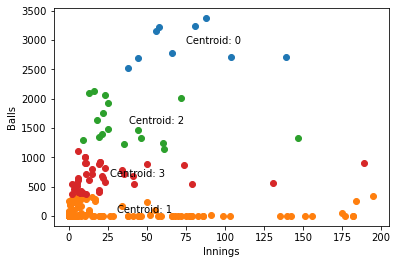
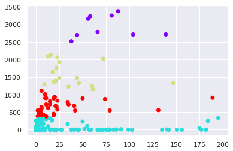
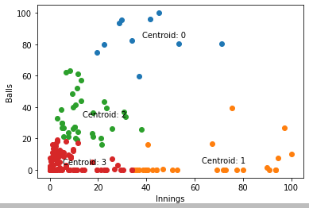
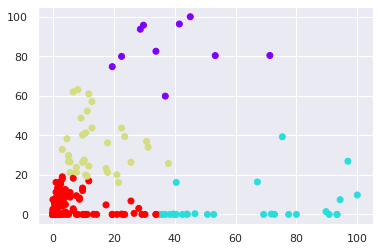

# A Simple Implementation of KMean Clustering Algorithm

The Below Code runs the KMean algorithm on the IPL data set to generate four clusters!

- Cluster 0: Batsman and also a Baller
- Cluster 1: Batsman but not a Baller
- Cluster 2: Not a Batsman but a Baller
- Cluster 3: Not a Batsman nor a Baller

In the code we have ran kMean on the simple data and then on the Normalized data and the difference is significant!

To Run the program on PC, clone the project and use Jupyter Notebook to view the code in the Code Directory of the project.

To view the project Checkout Jupyter Notebook Webview here: [Jupyter Notebook Webview](https://suhaan-bhandary.github.io/KMean-Clusturing-Algorithm/)

KMean              |  KMean with Normalization
:-------------------------:|:-------------------------:
  |  

## Comparing the Algorithm with the SKLearn Library

Data Passed| My Implementation Result              |  SKLearn Library Result
:-------------------------:|:-------------------------:|:-------------------------:
Regular Data|  |  
Normalized Data|  |  